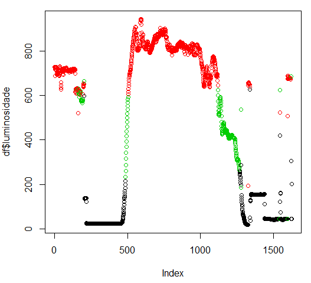
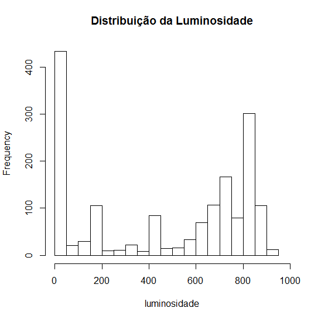
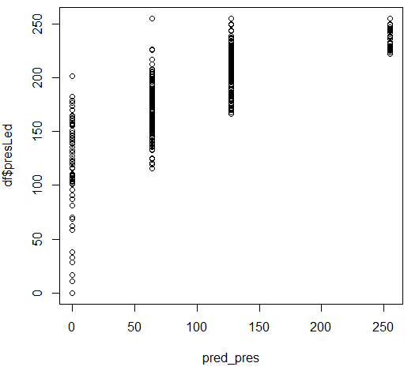
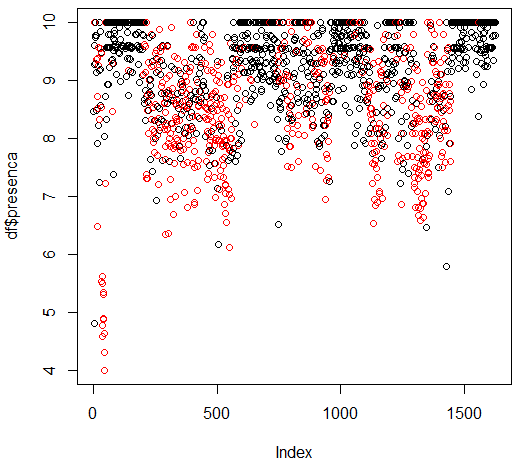

# Machine Learning em R
Machine Learning Básico implementado em R a partir dos dados coletados durante um dia do módulo de automação residencial.

## SOS e Vazamento de Gás
Nesse protótipo, também foram trabalhados os alertas no caso de pedido de SOS (socorro por parte do usuário) e Vazamento de Gás (detectado por um módulo sensor de gás).
Foi feita a integração com o * *Twitter* * e email, além de alerta ("pop-up") no próprio celular.
Dessa forma, mesmo que o usuário não tenha acesso ao aplicativo, o alerta será enviado por outros meios.
Observou-se que o email é a forma alternativa mais confiável (o * *Twitter* * muitas vezes não respondeu às requisições).

## RTC (Relógio de Tempo Real)
Foi incluído um Relógio de Tempo Real virtual (disponível na plataforma do Blynk), que é sincronizado a cada vez que o Arduino é ligado e conectado à rede (no setup).
Com isso, na inicialização do aplicativo, temos dados de data e horário atuais, além de mensagem de saudação a depender do horário do dia (Bom dia, Boa tarde ou Boa noite).

**Aulas Online e tutoriais usados**
[Datacamp](https://www.datacamp.com/)

**Código**
[Código R](script009.R)

**Dados**
[Consolidado](dados.csv)

**Dados básicos**

[Histograma da Presença](Hist_Presença.PNG)
[Dados Básicos](Summary.PNG)
[Aproximação pela Normal](Normal_Presença.PNG)
[Presença vs PresLed](PresençaVSPresLed.PNG)

**Classifier**

[Luz](Classifier_Luz.PNG)

**Cluster**

[Luminosidade Ambiente](Cluster_Luminosidade.PNG)
