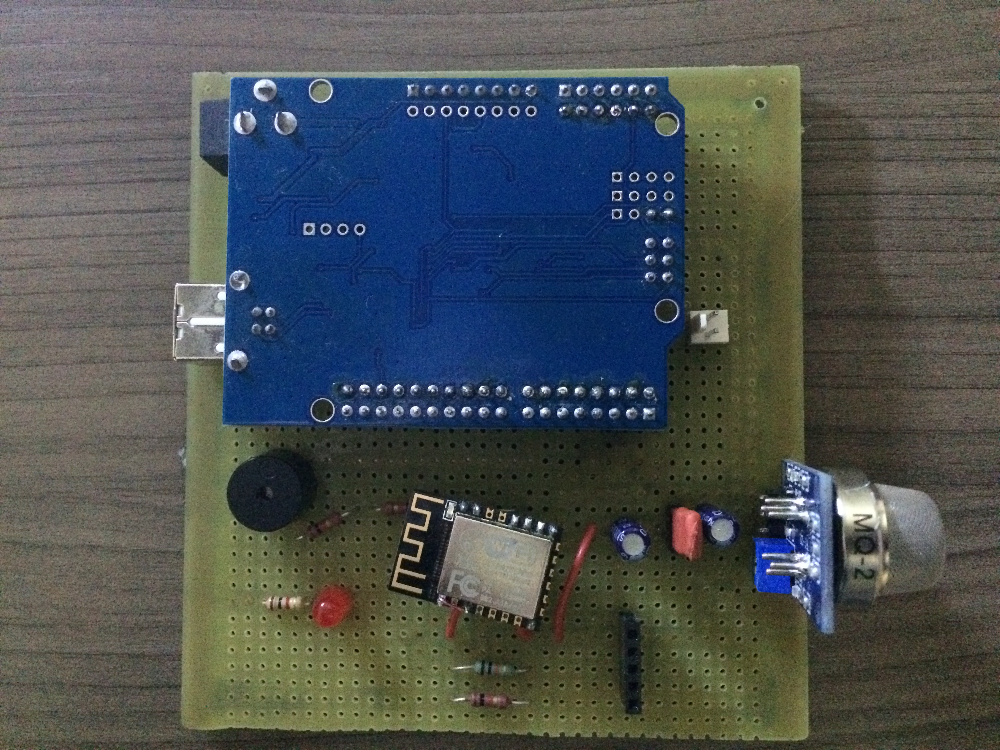
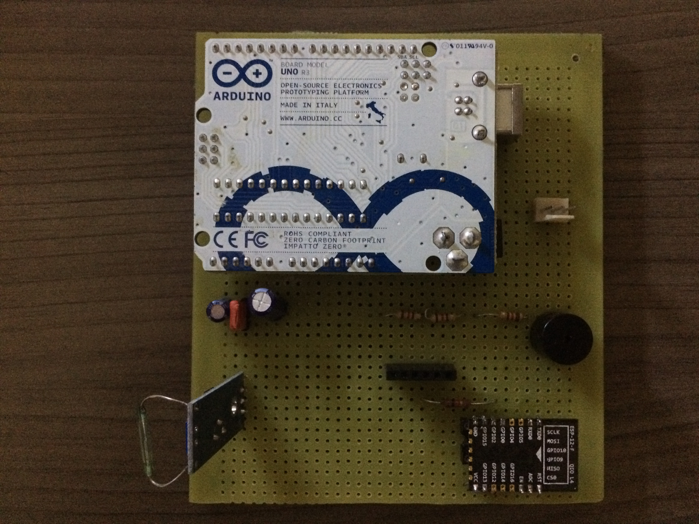
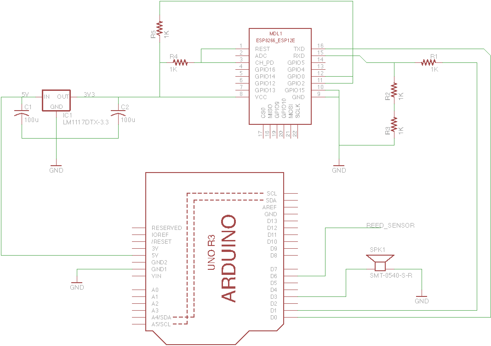

# Elderaid

Sistema de Casa Conectada destinada a idosos que moram sozinhos.

## Módulo de Gás

O módulo de gás tem como objetivo a detecção de possíveis vazamentos de gases inflamáveis na casa, tomando a devida ação para evitar acidentes graves.

### Componentes

O módulo contém um sensor de gás MQ-2 que envia um sinal analógico informando a concentração de gás inflamável detectado na região, um buzzer, que funcionará como alarme, um LED, para simular um atuador, um Arduino UNO, que será responsável pelo processamento de informações e um ESP8266-12f, que irá conectar o módulo ao servidor em cloud.

#### Esquemático

### Funcionamento

Durante seu funcionamento, o módulo está constantemente enviando informação do sensor ao servidor cloud, quando há a detecção de gás acima de um certo nível determinado o usuário recebe essa informação pelo aplicativo Android, podendo então tomar alguma decisão como acionar um atuador que cortaria a fornecimento de gás da residência. Se nada for feito depois de um tempo, o Arduino agirá por conta própria desligando o gás e acionando um alarme. 

## Módulo de Sensor Magnético

O módulo de Sensor magnético tem como objetivo a detecção de portas abertas pela casa, soando um alarme caso alguma porta esteja indevidamente aberta.

### Componentes

O módulo contém um sensor magnético com reed switch que envia um sinal digital informando se a porta está aberta(1) ou fechada(0), um buzzer, que funcionará como alarme, um Arduino UNO, que será responsável pelo processamento de informações e um ESP8266-12f, que irá conectar o módulo ao servidor em cloud.

#### Esquemático

### Funcionamento

Durante seu funcionamento, o módulo está constantemente enviando informação do sensor ao servidor cloud, quando há a detecção de uma porta aberta o usuário recebe essa informação pelo aplicativo Android, podendo então tomar alguma decisão como acionar o alarme para avisar o residente ou alguém que esteja por perto. Se nada for feito depois de um tempo, o Arduino agirá por conta própria acionando o alarme.
