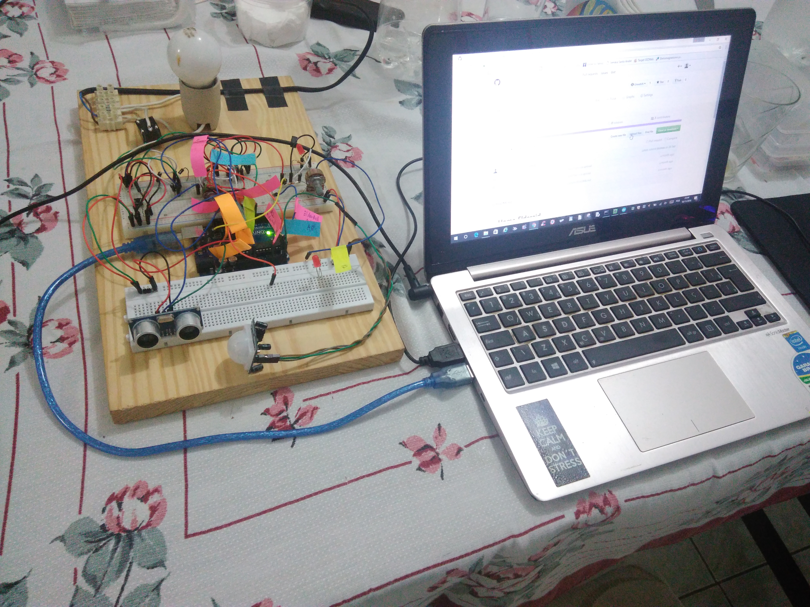
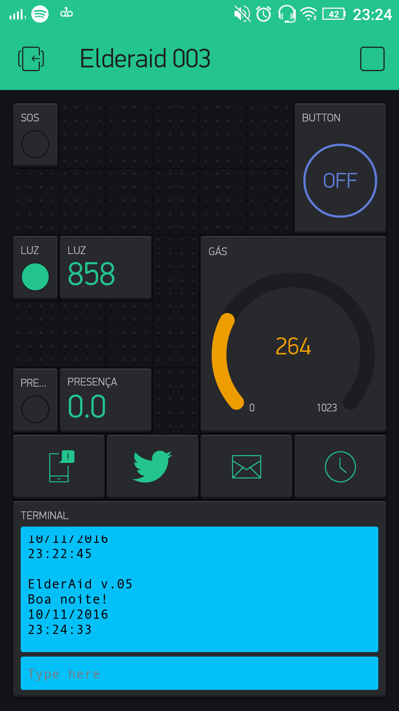
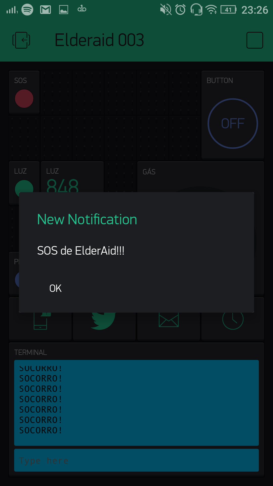
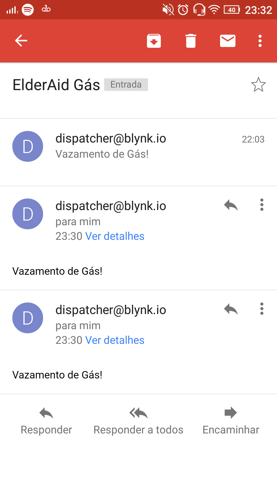

# ElderAid v.05
Módulo com sensor de luz (LDR, com sensibilidade ajustada através de um potenciômetro), módulo sensor de presença PIR e lâmpada com relé.
Montado em protoboard com objetivo de construção de módulo de automação residencial.
Além de possibilitar ao usuário que controle a lâmpada pelo aplicativo Blynk, essa versão possui um grau de automação para a luz (em determinada condição, a luz acende e fica assim por um determinado tempo, facilmente ajustável no código Arduino.
Se não houver luz ambiente (observado pelo sensor LDR) e houver alguém na sala (detectado pelo sensor de presença), a lâmpada é acesa e assim permanece por determinado tempo.

## SOS e Vazamento de Gás
Nesse protótipo, também foram trabalhados os alertas no caso de pedido de SOS (socorro por parte do usuário) e Vazamento de Gás (detectado por um módulo sensor de gás).
Foi feita a integração com o * *Twitter* * e email, além de alerta ("pop-up") no próprio celular.
Dessa forma, mesmo que o usuário não tenha acesso ao aplicativo, o alerta será enviado por outros meios.
Observou-se que o email é a forma alternativa mais confiável (o * *Twitter* * muitas vezes não respondeu às requisições).

## RTC (Relógio de Tempo Real)
Foi incluído um Relógio de Tempo Real virtual (disponível na plataforma do Blynk), que é sincronizado a cada vez que o Arduino é ligado e conectado à rede (no setup).
Com isso, na inicialização do aplicativo, temos dados de data e horário atuais, além de mensagem de saudação a depender do horário do dia (Bom dia, Boa tarde ou Boa noite).

**Código**
[Código Arduino](ElderAid005d.ino)

**Parte Física**

[Placa](v05_placa.jpg)

[LDR](v05_LDR.jpg)

[Placa](v05_placa.jpg)

[Lâmpada](v05_lampada.jpg)

**App Blynk**

[Gás](blynk_gas.png)

[Caso de desconexão](blynk_disconect.png)

[Email SOS](blynk_sos_email.png)

