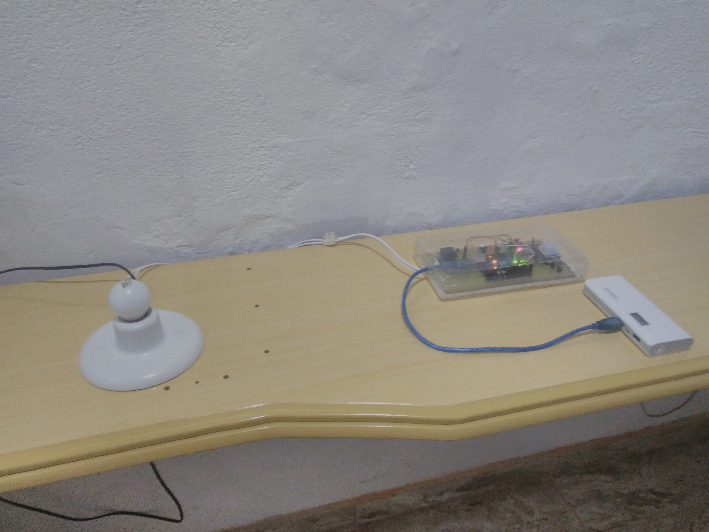
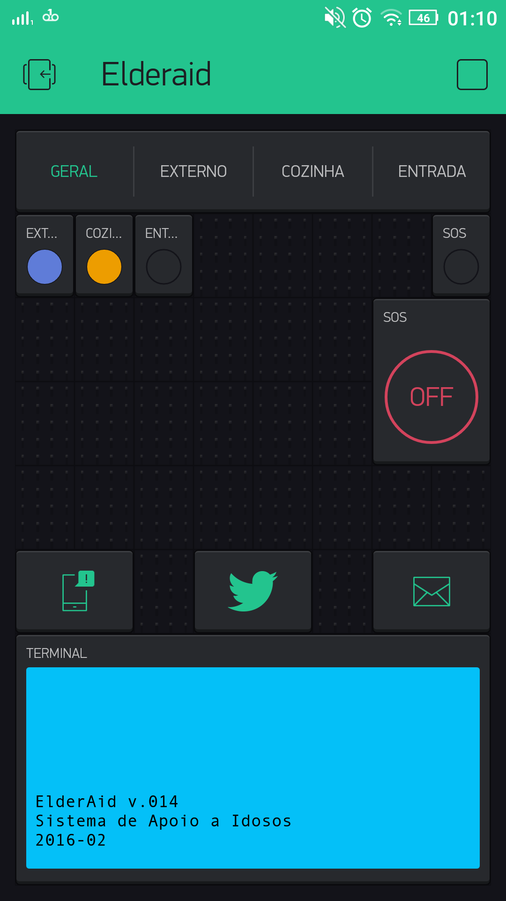
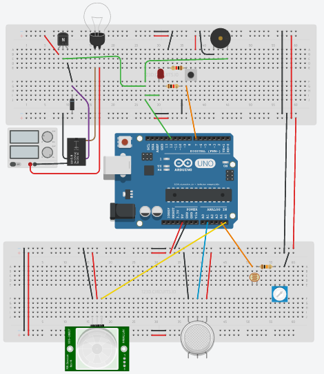

# Módulo de Automação Residencial

Módulo com sensor de luz (LDR, com sensibilidade ajustada através de um potenciômetro), módulo sensor de presença PIR e lâmpada com relé.
Montado em placa padrão. Para a versão anterior, veja Elderaid v.05.
Além de possibilitar ao usuário que controle a lâmpada pelo aplicativo Blynk, essa versão possui um grau de automação para a luz (em determinada condição, a luz acende e fica assim por um determinado tempo, facilmente ajustável no código Arduino.
Se não houver luz ambiente (observado pelo sensor LDR) e houver alguém na sala (detectado pelo sensor de presença), a lâmpada é acesa e assim permanece por determinado tempo.
Há dois modos: manual (usuário aciona a lâmpada remotamente) e automático, com a funcionalidade descrita.
Implementado em Arduino Uno, plataforma Blynk e ESP8266 como shield Wifi.
Etapas de implementação: conexão com ESP (dificuldades sanadas pelo uso de fios mais curtos para evitar interferência entre o ESP e o Arduino;
Depuração através do servidor do Blynk; Integração com o nosso servidor e então com o aplicativo próprio (Android).

## SOS
Nesse protótipo, também foram trabalhados os alertas no caso de pedido de SOS (socorro por parte do usuário e alerta remoto por parte do parente ou próprio usuário).
Foi usada uma interrupção externa do Arduino para confiabilidade da informação.
O acionamento do alarme (Buzzer + Led) pode ser feito pelo aplicativo ou por meio de botões físicos (aqui representando algum botão que fique com a pessoa, ou em lugar crítico da casa).

**Código**
[Código Arduino - Elderaid_v14](Elderaid_v14.ino)

**Parte Física**

[Detalhe 1](Detalhe_1.jpg)

[Detalhe 2](Detalhe_2.jpg)

**App Blynk**

[Automático](Automático.png)

[Manual](Manual.png)

[SOS](SOS.png)

**Esquemático da Placa**

Sem a funcionalidade de SOS adicional.

